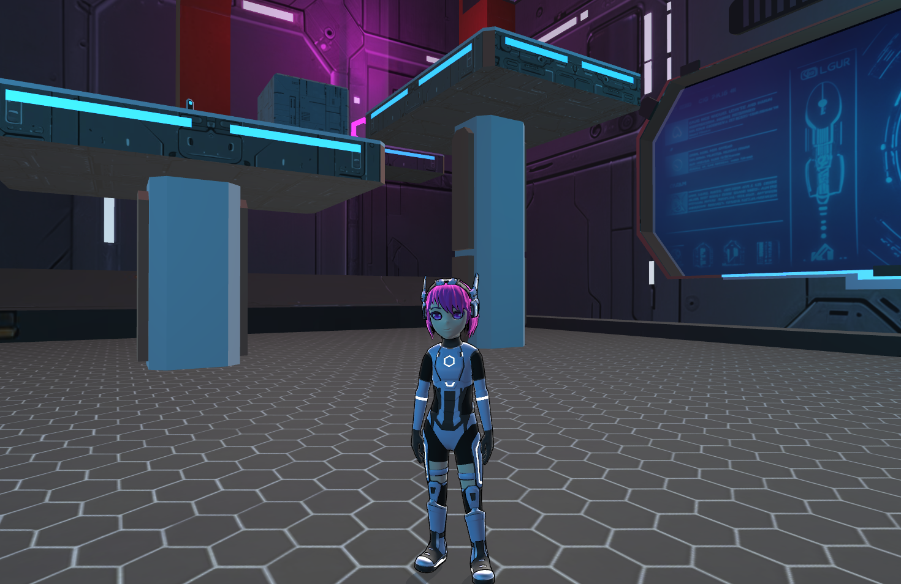

# Lola — a third-person game example built with Babylon.js

**Lola** — a demonstration of developing a third-person game using JavaScript (TypeScript) with the Babylon.js library. The project provides a ready-to-use foundation for further expansion and integration of additional features.

---

## **Key Features**

### **Collisions**
- Player collision system. Any level of complexity for collisions can be implemented.
- Camera collision system with collision objects.

### **Interactive Elements**
- A door that opens when the player approaches.
- A jump pad that propels the character.

---

### **Character Movement**
- Features implemented:
  - Jumping.
  - Speed boosts (upon collecting power-ups).
  - Running.
  - Walking.
  - Idle state animations.

- **Camera**: smooth zooming in and out when the player accelerates.

---

### **Dynamic Lighting**
- Overcomes limitations on the number of light sources with dynamic position changes:
  - Lights activate when the player approaches.
  - Lights deactivate when the player moves away.

---

### **Particle Effects**
- Particles appear:
  - When collecting power-ups.
  - Upon character landing.

---

### **Sound Design**
- **Action Sounds**:
  - Character footsteps.
  - Door opening and closing.
- **Background Audio**:
  - Atmospheric music.
  - Environmental sound effects.

---

### **Blender Integration**
- Uses the official plugin for exporting scenes from Blender to Babylon.js.
- Blender scene source files are included in the project.

---

### **Additional Technical Features**
- **LOD (Levels of Detail)**: model optimization based on player distance.
- **Prefabs**: convenient creation and management of repeating scene elements.

### **Custom Container Manager**
- Ensures that called containers (GLTF) load only once, with subsequent requests creating instances from the original.

---

### **Multiplayer**
- Basic multiplayer implemented with the **ColiseusJS** library:
  - Key press data transmission and player position synchronization.
  - Ability to create rooms with passwords for private sessions.
- Suitable as a foundation for developing more complex server systems.
- Currently operates without validation and fully trusts clients. Use with caution!

[Server Repository](https://github.com/wdda/lola-server)

---

### **Interface**
- **Vue.js** is used for creating in-game and menu interfaces.
- Support for mobile device controls via a virtual joystick (**Nipple.js**).

---

### **Additional Features**
- Easy level addition with a configuration file for levels and their names.
- Environment settings configurable via a file.

---

## **In-Game Store**
- **Game state management** is implemented using an in-game store.
- **Event subscription**:
  - Ability to subscribe to in-game events (e.g., level completion, power-up collection).
  - Designed for flexible game process management.

---

Lola is not a finished project, and I will continue to improve it, especially if the community shows interest.

All game materials (objects, textures, sounds, etc.) are created independently. You are free to use them for any purpose, considering the licenses of the JavaScript libraries used in the project.

I appreciate your pull requests, questions, and suggestions!

Peace and goodwill to everyone!:)

[Lola Game BabylonJS](https://www.youtube.com/watch?v=T6sXpVTGpqY)
